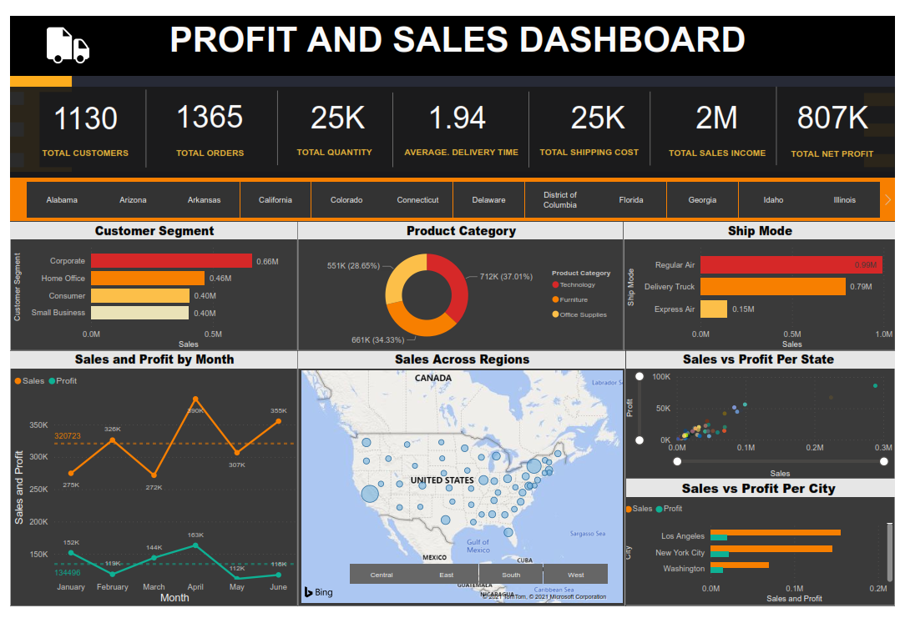

# -Sales-Analytics-Interactive-Dashboard
- Created using Power BI to visualize sales data stored in a MySQL database. 
- Used MySQL queries to explore database. 
- Loaded into Power BI, modeled data using star schema design 
- cleaned and transformed data using Power Query Editor.

## Snapshot of the dashboard 

